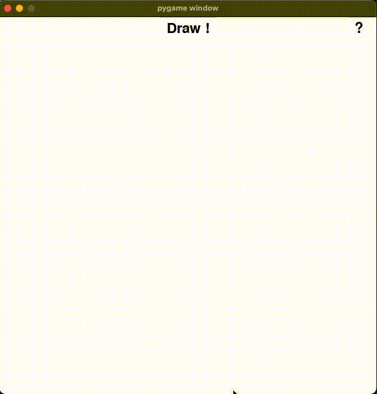
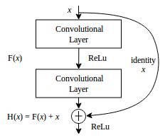

# Tiny Quick Draw

## Introduction
A minimalist version of the the Google ["Quick, Draw !"](https://quickdraw.withgoogle.com/). Test your drawing skills against an AI that guesses what you are sketching !

<div align="center">
    
</div>

## Architecture
For this project, I chose reimplement a ResNet, a popular architecture known for its proficiency in complex image recognition tasks.
This ResNet was trained from scratch to see where I can go.

This model is implemented with TensorFlow and Keras.

<div align="center">
	
	<figcaption><i>ResNet bloc</i></figcaption>
</div>

## Data
The data for this project are sourced directly from the [quickdraw](https://pypi.org/project/quickdraw/) package. This package provides an accessible way to fetch a diverse array of sketches from the extensive Google Quick Draw collection.

## Interface
The user interface is powered by Pygame, chosen for its simplicity and effectiveness in redering graphics.
It provides a simple canvas for users to draw their sketches.

If you want to reset the canvas, press <kbd>r</kbd>.

## Setup
```
git clone https://github.com/mapapin/tiny_quick_draw.git
cd tiny_quick_draw
make install
source venv/bin/activate
make run
```

## Clean env
```
make clean
```

## Retrain the Model
To retrain the model with your custom parameters, follow these steps:

1. Prepare your configuration file in the YAML format.
2. Start the training process using the command:

```
make train
```

This command will use the default configuration file.

3. If you wish to use a custom configuration file, execute the following command:

```
make train CONFIG_PATH=path/to/config.yaml
```

Replace `path/to/config.yaml` with the actual path to your custom YAML configuration file.

After retraining the model with your desired parameters, you may want to run the interface with the newly trained model. Execute the command below to do so:

```
make run MODEL_PATH=path/to/model.h5 CONFIG_PATH=path/to/the/corresponding/config.yaml
```
Here, `path/to/model.keras` should be replaced with the path to your trained model file, and `path/to/the/corresponding/config.yaml` with the path to the configuration file used for training this model.
